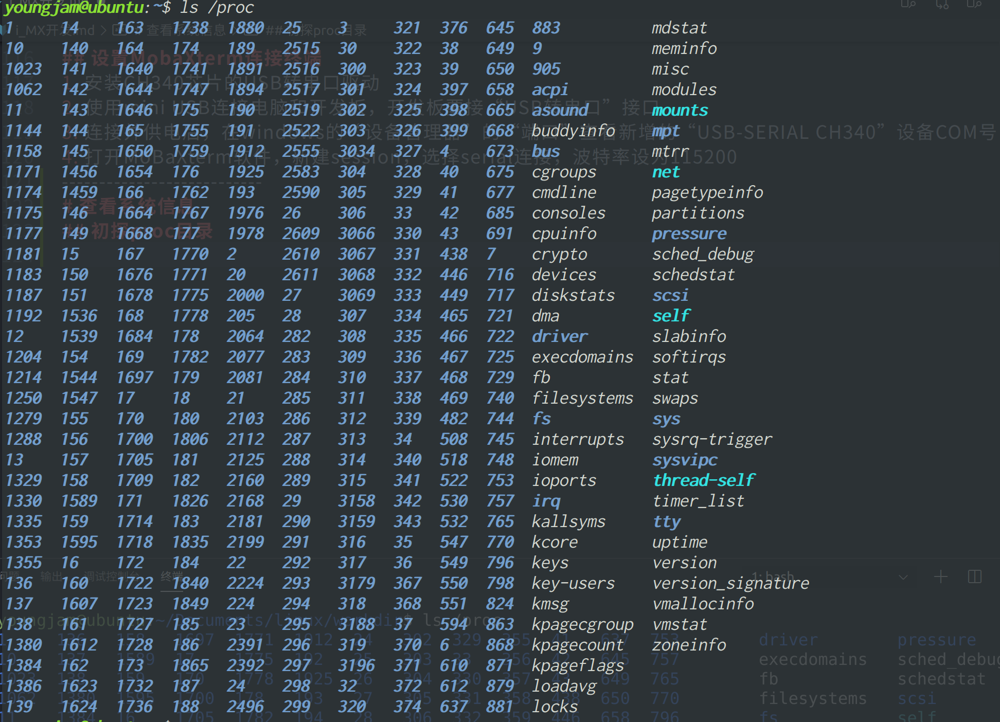

<!--
 * @Author: youngjam
 * @Date: 2020-06-21 15:52:05
 * @LastEditTime: 2020-06-22 10:44:00
 * @Description: imx开发笔记
 * @logs: 
 * 6.21 增加开发板硬件资源、烧录镜像、启动设置等
 * 6.22 增加查看系统信息
--> 
<!-- TOC -->

- [EBF6ULL Pro硬件资源](#ebf6ull-pro硬件资源)
- [SD卡烧录Debian镜像](#sd卡烧录debian镜像)
  - [Etcher工具](#etcher工具)
  - [野火Debian镜像](#野火debian镜像)
  - [烧录过程](#烧录过程)
- [让开发板跑起来](#让开发板跑起来)
  - [启动方式](#启动方式)
  - [硬件准备](#硬件准备)
  - [启动步骤](#启动步骤)
  - [设置MobaXterm连接终端](#设置mobaxterm连接终端)
- [查看系统信息](#查看系统信息)
  - [初探proc目录](#初探proc目录)
  - [查看cpu信息](#查看cpu信息)
  - [查看内核版本](#查看内核版本)
  - [查看内存信息](#查看内存信息)
  - [查看flash存储器容量](#查看flash存储器容量)
  - [查看任务进程](#查看任务进程)
  - [查看支持的文件系统](#查看支持的文件系统)
  - [查看cpu当前主频](#查看cpu当前主频)
  - [* cat /sys/devices/system/cpu/cpu0/cpufreq/cpuinfo_cur_freq](#ullicat-sysdevicessystemcpucpu0cpufreqcpuinfo_cur_freqliul)
- [fire-config工具](#fire-config工具)
  - [设置ssh](#设置ssh)
  - [fire-config刷机](#fire-config刷机)
  - [fire-config连接wifi](#fire-config连接wifi)

<!-- /TOC -->
# EBF6ULL Pro硬件资源
* 板载硬件资源  
    
* 硬件资源表
    |资源|说明|
    |:----|:-----|
    |DC12V接口|DC 12V&2A 直流输入，不支持电脑usb供电，电流不够|
    |usb转串口|使用 miniUSB 接口，使用CH340驱动|
    |KEY|reset 1个，onoff 1个，wakeup 1个，mode 1个|
    |rgb灯|由3个独立的r、g、b小灯组成|
    |六轴陀螺仪|型号MPU6050|
    |DB9接口|2路，一路母头DB9，一路工头DB9，使用RS232协议|
    |485接口|2路，2接线柱引出，使用RS485协议|
    |CAN接口|2路，2接线柱引出，使用CAN协议|
    |EBF接口|1个，使用1^6P排母引出，适用于连接使用串口协议的小模块|
    |启动配置|通过一个8位的拨码开关配合实现|
    |以太网|2路百兆以太网，型号KSZ8081RNB|
    |SPDIF收发|1\*SPDIFIN，1\*SPDIFOUT，用于音频光纤输入输出|
    |JTAG接口|1个|
    |音频接口|1\* IN，1\* OUT，3.5mm音频座；1*MIC IN，电容咪头，使用WM8960芯片解码|
    |环境光传感器|型号AP3216C|
    |红外接收|型号HS1838|
    |温湿度接口|可接入DHT11/DS18B20传感器|
    |喇叭接口|可用型号：3080|
    |摄像头接口|可配套使用野火ov5640摄像头|
    |蜂鸣器|有源蜂鸣器，3.3V|
    |USB HOST|4路通过芯片原生内扩|
    |micro USB|原生引出，支持OTG|
    |电位器|1k阻值变动|
    |RTC座子|电池座，通用电池型号CR1220|
    |WIFI & 蓝牙|型号：AP6236，不能与SD卡同时使用|
    |SD卡卡座|microSD卡卡座，支持SD3.0，不能与WIFI同时使用|
    |电容按键|可检测到触摸开关状态|
    |HDMI接口|板载HDMI转换芯片，使用RGB转HDMI，可直接使用HDMI信号线连接至HDMI屏幕|
    |LVDS接口|板载RGB转LVDS芯片|
    |LCD接口|FRC接口，RGB888及I2C触摸信号|
    |GPIO|通过两排2\*40P的2.54间距排针引出，可自主连接各种外部设备|
-----------------------------------------------
# SD卡烧录Debian镜像
## Etcher工具
* 跨平台镜像烧录工具
* 官网地址：https://www.balena.io/etcher/
## 野火Debian镜像
* imx6ull-debian-buster-console-armhf-2020-04-09.img.xz：
    debian的纯净版固件，没有带桌面环境和野火的QT APP
* imx6ull-debian-buster-desktop-armhf-2020-04-09.img.xz：
    带有桌面环境的debian固件，系统启动会进入桌面环境
* imx6ull-debian-buster-full-qt-app-armhf-2020-04-09.img.xz：
    具有完整QT App功能的debian固件，系统启动会进入QT App界面，该固件超过nandflash 512M的容量，只可烧录于eMMc
* imx6ull-debian-buster-part-qt-app-armhf-2020-04-09.img.xz：
    该固件移除了音频播放功能的QT App，系统启动会进入QT App界面，大约420M，可烧录于nandflash和eMMc中
* README.txt：文件记录了固件的使用说明及版本改动记录
* SHA256SUMS.txt：记录了各个固件的sha256校验值
## 烧录过程
1. 选择烧录镜像，选择要烧录的SD卡，点击flash进行烧录
2. 当界面出现flash complete表示烧录完成
3. 开发板插入烧录好的sd卡，调整拨码开关为sd卡启动方式，上电后即可正常使用
* 开发板第一次从sd卡启动时，系统会自动进行sd卡扩容，扩容完毕后，系统自动重启生效
* 普通用户：
    ```
    账号：debian
    密码：temppwd
    ```
* root用户：
    ```
    账号：root
    密码：root
    ```
--------------------------------------
# 让开发板跑起来
## 启动方式
* 启动方式配置，拨码开关拨至ON为1  
    |编号|名称|Nand Flash|eMMc|SD|USB|
    |:---:|:----:|:-------------:|:-----:|:--:|:----:|
    |1|MODE0|0|0|0|1|
    |2|MODE1|1|1|1|0|
    |3|CFG1-4|1|0|0|X|
    |4|CFG1-5|0|1|0|X|
    |5|CFG1-6|0|1|1|X|
    |6|CFG1-7|1|0|0|X|
    |7|CFG2-3|0|1|0|X|
    |8|CFG2-4|0|0|1|X|
## 硬件准备
* EBF6ULL Mini或Pro开发板
* Mini板使用5V电源，Pro使用12V电源
* USB Mini接口的USB线
* 一台windows系统电脑
* 配套的屏幕
## 启动步骤
1. 设置拨码开关
2. 连接好显示屏
3. 连接对应的电源
4. 打开电源开关
## 设置MobaXterm连接终端
1. 安装CH340芯片的USB转串口驱动
2. 使用mini USB连接电脑和开发板，开发板要接“USB转串口”接口
3. 连接并供电后，在windows的“设备管理器”的“端口”查看新增的“USB-SERIAL CH340”设备COM号
4. 打开MoBaXterm软件，新建session，选择serial连接，波特率设为115200

---------------------------
# 查看系统信息
## 初探proc目录
* 系统运行信息记录在/proc目录下的文件中
    
## 查看cpu信息
* cat /proc/cpuinfo
## 查看内核版本
* cat /proc/version
* uname -a
## 查看内存信息
* cat /proc/meminfo
* free
## 查看flash存储器容量
* cat /proc/partitions
## 查看任务进程
* proc目录下使用 ls pid
* top 实时更新进程信息，"q"和"ctrl+c"退出
## 查看支持的文件系统
* cat /proc/filesystems
## 查看cpu当前主频
* cat /sys/devices/system/cpu/cpu0/cpufreq/cpuinfo_cur_freq
----------------------------------------
# fire-config工具
## 设置ssh
* 上电启动开发板，开发板默认开启ssh服务，可通过指令`sudo systemctl status ssh`查看
* 确保网络连接正常(wifi正确配置后才能使用)，可通过指令`ifconfig`查看ip地址
* 使用ssh客户端登录
  * vscode：安装Remote-SSH插件，使用"ctrl+shift+p"快捷键打开命令面板，输入"Remote-SSH"迅速找到"Remote-ssh:connect to host"
  * 选择"Add New SSH Host"
  * 根据开发板ip，在ssh登录界面输入登录命令
  * 选择配置文件保存主机ip和用户名
  * 提示检查主机公钥指纹，选择"continue"
  * 输入主机用户密码
  * 登录成功后，在菜单栏打开"Terminal"，新建终端
  * 输入"sudo fire-config"命令，选择"SSH-connect"
  * 系统提示"Would you like the SSH server to be enabled?"，选择< Yes > 或< No >来分别对ssh进行使能和禁止即可
## fire-config刷机
1. 开发板正常启动后，在串口登录debian系统
2. 执行"sudo fire-config"，选择"fisher"项
3. 系统提示"Would you like the flasher to be enabled?"，选择< Yes >
4. 系统提示"The flasher is enabled"，选择< OK >
5. 返回"fire-config"初始界面，选择< Finsh >
6. 系统提示"Would you like to reboot now?"，选择< Yes >
7. 系统自动重启
8. 重启的系统将自动进行eMMc或者nandflash刷机
9. 刷机过程大约2～3分钟，刷机完成后，控制台会重新进入串口登录页面，此时观察开发板led灯，若led持续闪烁，说明刷机成功
10. 刷机成功后，调整拨码开关，重新上电启动
* 使用读卡器将sd卡接入到电脑，打开sd卡boot分区，修改该分区的uEnv.txt文件，修改"#flash_firmware=enable"，去掉"#"即可使能自动烧录
## fire-config连接wifi
* wifi和sd卡共用sdio接口， 进行配置wifi之前，要先通过fire-config工具刷机，确认开发板可以从nandflash或eMMc正常启动
* 刷机完成后，修改跳线帽连接方式
    1. 在终端执行"sudo fire-config"命令，选择"wifi"项
    2. 系统提示"Would you like the wifi interface to be enabled?"，选择< Yes >项，使能wifi模块
    3. 系统提示"The wifi interface is enabled"，选择< OK >项返回菜单
    4. 在主菜单选择< Finish >项， 系统提示"Would you like to reboot now?"，选择< Yes >项，等待系统重启。此时wifi驱动模块和wifi自动连接服务已配置完成
    5. 系统重启后，继续在系统中执行"sudo fire-config"命令，选择"wifi_scan"项，系统会扫描所有周围的无线网络，并在界面显示wifi的的名字和信号强弱；若暂时没有识别，可以多次扫描
    6. 确保系统搜索到目标wifi后，选择< OK >项返回主菜单，选择"wifi_setting"项
    7. 输入目标wifi账号和密码，输入完成后选择< OK >
    8. 选择主菜单< Finish >项，退出fire-config工具，执行"ifconfig"命令，可以看到开发板wifi的ip地址已经分配成功